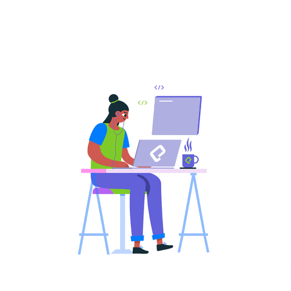

# [Yingyao Lu](https://yingyao.xyz)  
<h2> Hi there , fellow <𝚌𝚘𝚍𝚎𝚛𝚜/>! ></h2>

I am Yingyao Lu ☺️. I'm a ✈️ world traveller,  team player  care giver and an  innovative Software Engineer, currently pursuing Master of Computing and Innovation at the University of Adelaide.  

I'm passionate about technologies💻 and obsessed with the idea of improving himself and wants to grow and excel in it. I love to explore and learn programming online, and developing ⭐ fun projects to gain some hands-on experiences.

Welcome to check out my recent works on  GitHub.

Happy Coding!! Cheers! 

  
## ⚡ Technologies

- Front-end development using **HTML, Javascript,CSS,Bootstrap**
- Backend development using **NodeJS,ExpressJS**
- Implementation of **Machine Learning** algorithms
- Different projects regarding **Natural Language Processing**
- Known to database languages like **SQL and MySQL**

**Languages and Tools:**  

<code></code>
<code></code>
<code></code>
<code></code>
<code></code>
<code></code>
<code></code>
<code></code>
<code></code>

### Hello world!
- 💬 Homepage: [Yingyao.codes](http://yingyao.codes)
- 📝 Resume: [Please click here](http://yingyao.codes/Resume2020.pdf)

# Connect with me

|  |  | |  | 
|:---:|:---:|:---:|:---:|:---:|:---:|:---:|:---:|

Cheers!
